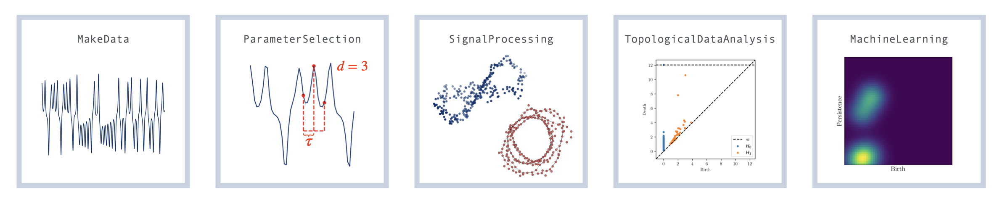

Description
==============

The emerging field of topological signal processing brings methods from Topological Data Analysis (TDA) to create new tools for signal processing by incorporating aspects of shape.
This python package, teaspoon for tsp or topological signal processing, brings together available software for computing persistent homology, the main workhorse of TDA, with modules that expand the functionality of teaspoon as a state-of-the-art topological signal processing tool.
These modules include methods for incorporating tools from machine learning, complex networks, information, and parameter selection along with a dynamical systems library to streamline the creation and benchmarking of new methods.
All code is open source with up to date documentation, making the code easy to use, in particular for signal processing experts with limited experience in topological methods.


Full documentation of this package is available [here](https://teaspoontda.github.io/teaspoon/). The full documentation includes information about installation, module documentation with examples, contributing, the license, and citing teaspoon.

The code is a compilation of work done by [Elizabeth Munch](http://www.elizabethmunch.com) and [Firas Khasawneh](http://www.firaskhasawneh.com/) along with their students and collaborators.  People who have contributed to teaspoon include:

- [Audun Myers](https://www.audunmyers.com)
- [Melih Yesilli](https://www.melihcanyesilli.com)
- [Sarah Tymochko](https://www.egr.msu.edu/~tymochko/)
- [Danielle Barnes](https://github.com/barnesd8)
- [Sunia Tanweer](https://stanweer1.github.io/)
- [Max Chumley](https://www.maxchumley.com/)
- [Ismail Guzel](https://ismailguzel.github.io/)

We gratefully acknowledge the support of the National Science Foundation, which has helped make this work possible.

About TSP
=========



Many topological signal processing projects can be fit into the pipeline shown above; and this pipeline aligns with the five submodules of `teaspoon`. 
We start with input time series data. In `teaspoon`, the [`MakeData`](https://teaspoontda.github.io/teaspoon/modules/MakeData/index.html) module provides methods for creating synthetic data sets for testing purposes, including the [`DynSysLib`](https://teaspoontda.github.io/teaspoon/modules/MakeData/DynSysLib/index.html) submodule with an extensive array of dynamical systems. 
The [`ParameterSelection`](https://teaspoontda.github.io/teaspoon/modules/ParamSelection/index.html) modules provides tools for determining best parameters for transforming the time series into a delay coordinate (sometimes called Takens') embedding. This includes standard tools such as false nearest neighbors and mutual information function as well as newly developed tools. The [Signal Processing `SP`](https://teaspoontda.github.io/teaspoon/modules/SP/index.html) module does the conversion from a time series to a topological input. This includes the standard delay coordinate embedding, as well as network representations of time series. This topological input can be converted to a topological signature, in most cases a persistence diagram, using the [Topological Data Analysis `TDA` ](https://teaspoontda.github.io/teaspoon/modules/TDA/index.html) module. Finally, these persistence diagrams can be used in a machine learning pipeline using the vectorization tools from the [Machine Learning `ML`](https://teaspoontda.github.io/teaspoon/modules/ML/index.html) module. 


Installation
=============
To install this package, both boost and CMake must be installed as system dependencies.  For boost see for [unix](https://www.boost.org/doc/libs/1_66_0/more/getting_started/unix-variants.html) and [windows](https://www.boost.org/doc/libs/1_62_0/more/getting_started/windows.html).  For mac, you can run ``brew install boost`` if using homebrew as a package manager.  For CMake see [here](https://cmake.org/install/).

The teaspoon package is available through pip install with version details found [here](https://pypi.org/project/teaspoon/).
The package can be installed using the following pip installation:

```bash
pip install teaspoon
```

To install the most up-to-date version of the code, you can clone the repo and then run

```bash
pip install .
```

from the main directory.  Note that the master branch will correspond to the version available in pypi, and the test_release branch may have new features.

Please reference the requirements page in the [documentation](https://teaspoontda.github.io/teaspoon/) for more details on other required installations.

Contacts
=============
* Liz Munch: [muncheli@msu.edu](mailto:muncheli@msu.edu)
* Firas Khasawneh: [khasawn3@egr.msu.edu](mailto:khasawn3@egr.msu.edu)
