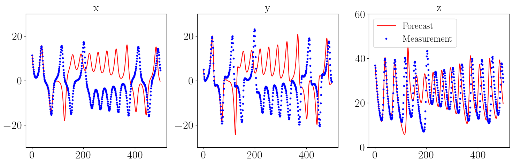

Forecasting
=========================================================

This page outlines the available time series forecasting functions. 

.. automodule:: teaspoon.DAF.forecasting
    :members: 

**Example**::

    import numpy as np
    from matplotlib import rc
    import matplotlib.pyplot as plt
    from matplotlib.gridspec import GridSpec
    from teaspoon.MakeData.DynSysLib.autonomous_dissipative_flows import lorenz
    from teaspoon.DAF.forecasting import random_feature_map_model
    from teaspoon.DAF.forecasting import get_forecast

    # Set font
    rc('font', **{'family': 'sans-serif', 'sans-serif': ['Helvetica']})
    rc('text', usetex=True)
    plt.rc('text', usetex=True)
    plt.rc('font', family='serif')
    plt.rcParams.update({'font.size': 16})

    # Set model parameters
    Dr=300
    train_len = 4000
    forecast_len = 2000

    r_seed = 48824
    np.random.seed(r_seed)

    # Get training and tesing data at random initial condition
    ICs = list(np.random.normal(size=(3,1)).reshape(-1,))
    t, ts = lorenz(L=500, fs=50, SampleSize=6001, parameters=[28,10.0,8.0/3.0],InitialConditions=ICs)
    ts = np.array(ts) 

    # Add noise to signals
    noise = np.random.normal(scale=0.01, size=np.shape(ts[:,0:train_len+forecast_len]))
    u_obs = ts[:,0:train_len+forecast_len] + noise

    # Train model
    W_LR, W_in, b_in = random_feature_map_model(u_obs[:,0:train_len],Dr, seed=r_seed)

    # Generate forecast
    forecast_len = 500
    X_model= get_forecast(u_obs[:,train_len], W_LR, W_in, b_in,forecast_len=forecast_len)
    X_meas = u_obs[:,train_len:train_len+forecast_len]

    # Plot measurements and forecast
    fig = plt.figure(figsize=(15, 5))
    gs = GridSpec(1, 3)
    ax1 = fig.add_subplot(gs[0, 0])
    ax1.plot(X_model[0,:],'r', label="Forecast")  
    ax1.plot(X_meas[0,:], '.b', label="Measurement")
    ax1.plot([],[])
    ax1.set_title('x', fontsize='x-large')
    ax1.tick_params(axis='both', which='major', labelsize='x-large')
    ax1.set_ylim((-30,30))

    ax2 = fig.add_subplot(gs[0, 1])
    ax2.plot(X_model[1,:],'r', label="Forecast")  
    ax2.plot(X_meas[1,:], '.b', label="Measurement")
    ax2.plot([],[])
    ax2.set_title('x', fontsize='x-large')
    ax2.tick_params(axis='both', which='major', labelsize='x-large')
    ax2.set_ylim((-30,30))

    ax3 = fig.add_subplot(gs[0, 2])
    ax3.plot(X_model[2,:],'r', label="Forecast")  
    ax3.plot(X_meas[2,:], '.b', label="Measurement")
    ax3.plot([],[])
    ax3.legend(fontsize='large', loc='upper left')
    ax3.set_title('x', fontsize='x-large')
    ax3.tick_params(axis='both', which='major', labelsize='x-large')
    ax3.set_ylim((0,60))

    plt.tight_layout()
    plt.show()

Output of example

.. note::
    Forecast may vary depending on the operating system. 