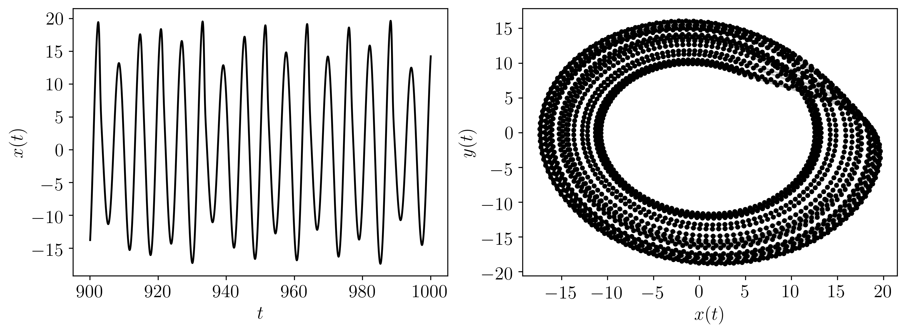

=====================================
Dynamical Systems Library (DynSysLib)
=====================================

.. image:: ../../../figures/time_series_chaotic_animation.gif
  :alt: :math:`x`-solution to simulated Rössler system for a chaotic response.
  :align: center
  :scale: 35

.. rst-class::  clear-both

This page provides a summary of the  Dynamical Systems Library (``DynSysLib``) for simulating a wide variety of dynamical systems. 

.. toctree::
   :maxdepth: 1

   maps
   autonomous_dissipative_flows
   driven_dissipative_flows
   conservative_flows
   periodic_functions
   noise_models
   medical_data
   delayed_flows

The following table provides a list of all the available dynamical systems. Further details for each system can be found in the linked directories. 

.. list-table:: Available Dynamical Systems
   :widths: 10 10 10 10 10 10 10 10
   :header-rows: 1

   * - `Maps <maps.md>`_
     - `Autonomous Dissipative Flows <autonomous_dissipative_flows.md>`_
     - `Driven Dissipative Flows <driven_dissipative_flows.md>`_
     - `Conservative Flows <conservative_flows.md>`_
     - `Periodic Functions <periodic_functions.md>`_
     - `Noise Models <noise_models.md>`_
     - `Medical Data <medical_data.md>`_
     - `Delayed Flows <delayed_flows.md>`_

   * - logistic_map
     - chua
     - driven_pendulum
     - driven_van_der_pol_oscillator
     - sine
     - gaussian_noise
     - ECG
     - mackey_glass
   * - henon_map
     - lorenz
     - shaw_van_der_pol_oscillator
     - simplest_driven_chaotic_flow 
     - incommensurate_sine
     - uniform_noise
     - EEG
     - 
   * - sine_map
     - rossler
     - forced_brusselator
     - nose_hoover_oscillator 
     - 
     - rayleigh_noise
     - 
     - 
   * - tent_map
     - coupled_lorenz_rossler
     - ueda_oscillator
     - labyrinth_chaos 
     - 
     - exponential_noise
     - 
     - 
   * - linear_congruential_generator_map
     - coupled_rossler_rossler
     - duffings_two_well_oscillator
     - henon_heiles_system
     - 
     - 
     - 
     - 
   * - rickers_population_map
     - double_pendulum
     - duffing_van_der_pol_oscillator
     - 
     - 
     - 
     - 
     - 
   * - gauss_map
     - diffusionless_lorenz_attractor
     - rayleigh_duffing_oscillator
     - 
     - 
     - 
     - 
     - 
   * - cusp_map
     - complex_butterfly
     - 
     - 
     - 
     - 
     - 
     - 
   * - pinchers_map
     - chens_system
     - 
     - 
     - 
     - 
     - 
     - 
   * - sine_circle_map
     - hadley_circulation
     - 
     - 
     - 
     - 
     - 
     - 
   * - lozi_map
     - ACT_attractor
     - 
     - 
     - 
     - 
     - 
     - 
   * - delayed_logstic_map
     - rabinovich_frabrikant_attractor
     - 
     - 
     - 
     - 
     - 
     - 
   * - tinkerbell_map
     - linear_feedback_rigid_body_motion_system
     - 
     - 
     - 
     - 
     - 
     - 
   * - burgers_map
     - moore_spiegel_oscillator
     - 
     - 
     - 
     - 
     - 
     - 
   * - holmes_cubic_map
     - thomas_cyclically_symmetric_attractor
     - 
     - 
     - 
     - 
     - 
     - 
   * - kaplan_yorke_map
     - halvorsens_cyclically_symmetric_attractor
     - 
     - 
     - 
     - 
     - 
     - 
   * - ginger_bread_man_map
     - burke_shaw_attractor
     - 
     - 
     - 
     - 
     - 
     - 
   * - 
     - rucklidge_attractor
     - 
     - 
     - 
     - 
     - 
     - 
   * - 
     - WINDMI
     - 
     - 
     - 
     - 
     - 
     - 
   * - 
     - simplest_quadratic_chaotic_flow
     - 
     - 
     - 
     - 
     - 
     - 
   * - 
     - simplest_cubic_chaotic_flow
     - 
     - 
     - 
     - 
     - 
     - 
   * - 
     - simplest_piecewise_linear_chaotic_flow
     - 
     - 
     - 
     - 
     - 
     - 
   * - 
     - double_scroll
     - 
     - 
     - 
     - 
     - 
     - 

    

Of the optional other parameters either the **dynamic_state parameter** or the system **parameters** must be used.

The following is a minimal working example using the *rossler* system::

    import matplotlib.pyplot as plt
    import matplotlib.gridspec as gridspec
    from teaspoon.MakeData.DynSysLib.autonomous_dissipative_flows import rossler
    
    t, ts = rossler(dynamic_state='periodic')
    
    TextSize = 15
    plt.figure(figsize = (12,4))
    gs = gridspec.GridSpec(1,2) 
    
    ax = plt.subplot(gs[0, 0])
    plt.xticks(size = TextSize)
    plt.yticks(size = TextSize)
    plt.ylabel(r'$x(t)$', size = TextSize)
    plt.xlabel(r'$t$', size = TextSize)
    plt.plot(t,ts[0], 'k')
    
    ax = plt.subplot(gs[0, 1])
    plt.plot(ts[0], ts[1],'k.')
    plt.plot(ts[0], ts[1],'k', alpha = 0.25)
    plt.xticks(size = TextSize)
    plt.yticks(size = TextSize)
    plt.xlabel(r'$x(t)$', size = TextSize)
    plt.ylabel(r'$y(t)$', size = TextSize)
    
    plt.show()

Where the output for this example is:

.. image:: ../../../figures/rossler_example_a.png

The following is another example implementing all of the possible inputs (dynamic_state is not needed when parameters are provided)::

    import matplotlib.pyplot as plt
    import matplotlib.gridspec as gridspec
    from teaspoon.MakeData.DynSysLib.autonomous_dissipative_flows import rossler
    

    L, fs, SampleSize = 1000, 20, 2000

    # the length (in seconds) of the time series, the sample rate, and the sample size of the time series of the simulated system.

    parameters = [0.1, 0.2, 13.0] # these are the a, b, and c parameters from the Rossler system model.

    InitialConditions = [1.0, 0.0, 0.0] # [x_0, y_0, x_0]

    t, ts = rossler(L=L, fs=fs, SampleSize=SampleSize, parameters=parameters,  InitialConditions=InitialConditions)
    
    TextSize = 15
    plt.figure(figsize = (12,4))
    gs = gridspec.GridSpec(1,2) 
    
    ax = plt.subplot(gs[0, 0])
    plt.xticks(size = TextSize)
    plt.yticks(size = TextSize)
    plt.ylabel(r'$x(t)$', size = TextSize)
    plt.xlabel(r'$t$', size = TextSize)
    plt.plot(t,ts[0], 'k')
    
    ax = plt.subplot(gs[0, 1])
    plt.plot(ts[0], ts[1],'k.')
    plt.plot(ts[0], ts[1],'k', alpha = 0.25)
    plt.xticks(size = TextSize)
    plt.yticks(size = TextSize)
    plt.xlabel(r'$x(t)$', size = TextSize)
    plt.ylabel(r'$y(t)$', size = TextSize)
    
    plt.show()

Where the output for this example is:

