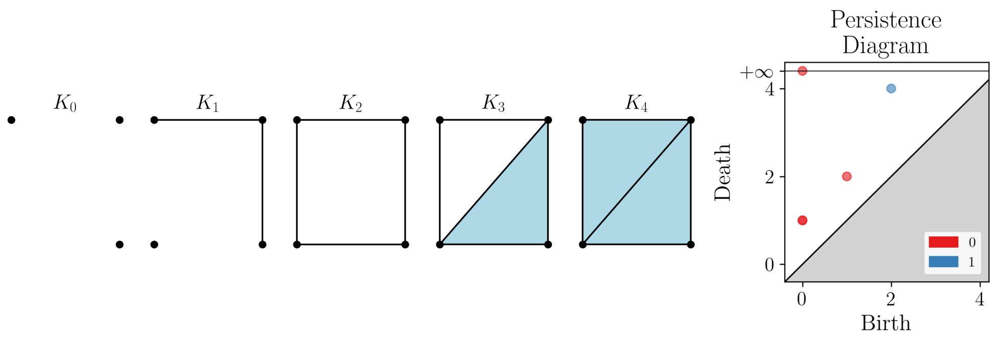
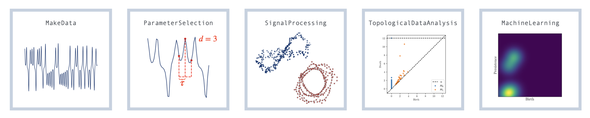

# Summary

The field of topological data analysis (TDA) has risen in the last two decades to become a mature field of research providing a unique perspective on data analysis.
TDA consists of a suite of tools inspired by the field of Algebraic Topology, which encodes shape and structure in data in a quantitative manner.
One particular subfield of work has focused on using TDA tools for the analysis of time series, colloquially known as Topological Signal Processing, or TSP.
The python package \texttt{teaspoon} has been built specifically to cater to the needs of researchers working in the field of TSP, with the added benefit that the code can be used for other forms of input data beyond signal.

Recent work has largely focused on the use of persistent homology and its variants for this context, thus this has been the main tool utilized in \texttt{teaspoon}.
While a full discussion of the specifics of persistence is outside the scope of this brief paper, we give a brief introduction here and direct the interested reader to @Dey2021 and @Munch2017 for more information.
Standard homology (see, e.g., @Hatcher) is a construction which builds a vector space for any input topological space $X$ and a given dimension $p$ of structure to be studied.
Denoted $H_p(X)$, the $p=0$ dimensional homology encodes the structure of connected components; $p=1$ encodes loops; $p=2$ encodes voids; and higher dimensional versions exist without the interpretability of these lower dimensional versions.
While homology is defined for a fixed topological space, persistent homology studies the changing homology for a changing topological space.
Indeed, through a fundamental theorem of persistence [@CrawleyBoevey2015], we can use this sequence of vector spaces to determine when $p$-dimensional structures appear (or are born) and disappear (or die).
The persistence diagram is a 2D scatter plot of points, each one giving the (birth, death) coordinates for a particular $p$-dimensional structure.

As an example, in Figure \ref{fig:example} we have a sequence of topological spaces in which we wish to track how the homology is changing, along with the corresponding persistence diagram (right).
Each red point in the persistence diagram at right represents a connected component (an $H_0$ feature), and each blue point represents a cycle (a $H_1$ feature).
For example, three vertices from $K_0$ are connected by edges in $K_1$, thus there are two persistence points at $(0,1)$ in dimension 0 corresponding to the fact that three connected components have merged into one.
Similarly, a cycle first appears in $K_2$ and is filled in at $K_4$, so there is a persistence point in dimension 1 at (2,4).

In the following section, we show how persistence can be used in a pipeline for signal processing by aligning each of the steps with the modules of the \texttt{teaspoon} package. 

# Package Modules

Many topological signal processing projects can be fit into the pipeline shown in \autoref{fig:Pipeline}.
This pipeline aligns with the five submodules of \texttt{teaspoon}, which we describe in more detail in the following subsections.  

## *Make Data*

First, we assume that we are given a collection of time series, perhaps simulated from varying a parameter in a known dynamical system.
For testing purposes, this can be done by generating synthetic data directly from the *MakeData* module.
The main feature of the module is the *Dynamic Systems Library (DynSysLib)* submodule, which includes a wide variety of dynamical systems.
As of writing, this includes maps, autonomous and driven dissipative flows, conservative flows, periodic functions, noise models, and delayed flows.
In addition, there is also synthetic data generation available for other types of data often used in TDA pipelines, including point clouds (such as those drawn from an annulus or torus) and functions (such as Gaussian fields).

## *Parameter Selection*

Once we have a time series, we can apply transforms to prepare the data for different versions of persistence, however these often require parameter choices.
One of the most commonly used transforms in the signal processing literature is the Takens embedding (sometimes called delay coordinate embedding) of the data into $\mathbb{R}^d$ for given dimension $d$ with a delay parameter $\tau$.
The choices of $d$ and $\tau$ for the embedding are subtle, however the *Parameter Selection* module has an extensive array tools for the automated computation of the parameters.
These include the standard options such as mutual information, auto-correlation, and false nearest neighbors; along with newly developed options using TDA and persistent homology to estimate embedding delays [@myers2024delay] by finding the delay that maximizes the 1D persistence lifetime or loop size of the attractor.
We continue to implement algorithms to make this module more comprehensive such as generalizations to the false nearest neighbors method in [@chelidze2017reliable] which uses strands of points to more reliably estimate the embedding dimension when noise is present and similarly, the 'Cao method' [@cao1997practical] has the added benefit of distinguishing deterministic signals from stochastic signals.

## *Signal Processing*

The transforms converting a time series into a mathematical structure available for TDA analysis are contained in the *Signal Processing (SP)* module.
This includes both standard tools as well as newly developed techniques that incorporate topological information.
For instance, the Takens embedding is included, which converts an input time series into a point cloud.
However, there are also more recent techniques which convert a time series into a network, such as the Ordinal Partition Network (OPN) [@McCullough2015; @Myers2023c] or the Coarse Grained State Space (CGSS) network [@Wang2016; @Myers2023a].
Similarly, standard entropy computations are included, as well as persistent (as in persistent homology) entropy. For more conventional time series analysis, a noise robust zero-crossing detection tool [@Tanweer2024_FODS] is included which detects all crossings of a discrete signal at once.
This module also includes the *Texture Analysis* submodule, which provides techniques for comparing experimental and nominal surface textures in manufacturing/machining applications [@Chumley2023].
The *Stochastic P-Bifurcation Detection* provides homological techniques for automatic and unbiased detection of Phenomenological Bifurcations in stochastic dynamical systems [@Tanweer2024_NODY; @Tanweer2024_PREM].

## *Topological Data Analysis*

After performing any necessary transformations, the *Topological Data Analaysis (TDA)* module has tools for computing topological signatures of data persistence on input data.
This module is largely wrappers for externally available code since much work has already been done to optimize this aspect of the pipeline.
Point cloud persistence, for instance when taking the Takens embedding as input, is computed using the external *ripser* Python package [@Bauer2021] in Scikit-TDA [@Saul2019].
Zero dimensional sublevel set persistence is computed with entirely internal code [@Myers2022].
The module also offers code for computing bottleneck distance---which relies on the *scikit-tda* *persim* package [@Saul2019]---and Wasserstein distance based on Optimal Transport Theory.
There is also code which makes it easier to use the fast zigzag software [@Dey2022] by providing a wrapper for generating the input file given a list of point clouds as well as filtering the resultant persistence diagram.
As newly available code is released and maintained, this means that all internal functions can be switched to other external packages as needed without a great deal of update to the remainder of the code.

## *Machine Learning*

Finally, once the time series has been converted into a persistence diagram representation, the *Machine Learning (ML)* module gives a variety of featurization methods to convert the persistence diagram into a vector based representation amenable to regression and classification tasks.
These include
persistence landscapes [@Bubenik2015],
persistence images [@Adams2017],
Carlsson coordinates [@Adcock2016],
template functions [@Perea2022],
path signatures [@Chevyrev2018],
and kernel methods [@Reininghaus2015].

# Statement of need

The \texttt{teaspoon} package is focused on applications of TDA to time series with an emphasis on ease of usability in a Python environment.
Optimization of the computation of persistence itself has been well studied by others and excellent code already exists for this aspect of the pipeline [@Otter2017].
Where applicable, \texttt{teaspoon} uses these codebanks, particularly for persistent homology computations.
Existing code banks include
Ripser [@Bauer2021],
GUDHI [@Boissonnat2016],
giotto-tda [@Tauzin2020],
dionysus2 [@Morozov2019],
scikit-tda [@Saul2019],
R-TDA [@Fasy2014],
and the Topology Toolkit (TTK) [@BinMasood2019].
However, persistence in these codebanks is often provided in a very general context.
So, \texttt{teaspoon} fills the gap by providing tailored, well-documented tools for time series that can be used with a lower barrier to entry.
This is not covered in other packages which are meant for broad applicability without specialization.

# Representative Publications Using Teaspoon

The \texttt{teaspoon} package was started in 2017 as a GitLab repository, and was ported to GitHub in 2018.
A previous but now outdated paper outlined the basic functionality of \texttt{teaspoon} at the time [@Myers2020].
Because of its longevity, a non-exhaustive but extensive list of papers
[
@Chumley2023;
@Elchesen2022;
@Gilpin2021;
@Guezel2022;
@Jones2023;
@Myers2022;
@Myers2023;
@Myers2023a;
@Myers2023b;
@Myers2023c;
@Myers2023;
@Perea2022;
@Tymochko2019
]
as well as theses
[
 @Tymochko2022;
@Yi2022;
 @Collins2022
]
have utilized \texttt{teaspoon}.

# Acknowledgements

This material is based in part upon work supported by the Air Force Office of Scientific Research under Award No. FA9550-22-1-0007.
It was additionally supported in part by the National Science Foundation through grants
CCF-1907591,
CCF-2106578,
and CCF-2142713.

# References
